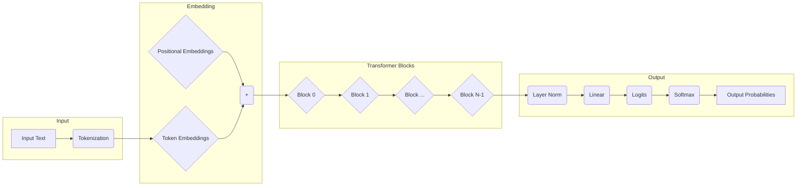
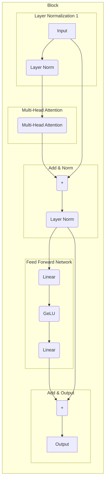
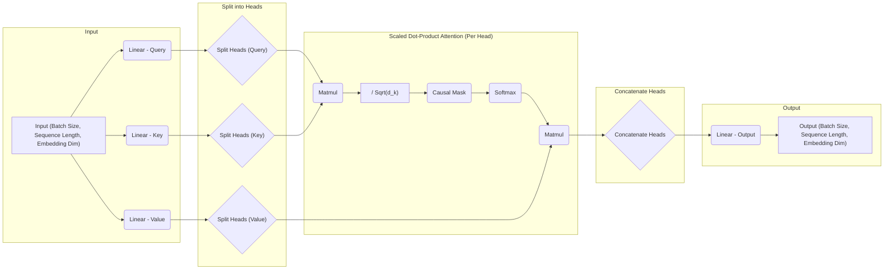

# Transformer (GPT Style) Implementation for Understanding LLMs

This repository is created for understanding Transformer models. It is based on the implementation of [examples/min-gpt](https://github.com/LaurentMazare/tch-rs/blob/main/examples/min-gpt/README.md) from tch-rs. The original code has been modified with added comments for better understanding.

> [!NOTE]
> This repository contains code that is still under development and may contain wrong information.

## How to Run

```bash
export TORCH_CUDA_VERSION=cu121 # If using CUDA.
cargo run -- train # Training
cargo run -- predict gpt1000.ot "Warwick: What is your name?" # Run inference
```

- Training for 1000 steps takes about 10 minutes using `g4dn.xlarge`.

## Architecture Overview

### Overview



### Transformer Block



### Attention Mechanism



## My Questions

### Why does GPT use only the decoder layer, while Transformer (Vaswani et al., 2017) has both encoder and decoder layers?

- **Superior Zero-shot Generalization Performance:** Decoder-only models like GPT have been reported to demonstrate higher zero-shot generalization performance compared to other architectures. This strength is particularly crucial for tasks like dialogue and text generation.
- **Focus on Autoregressive Generation:** The decoder architecture is inherently focused on autoregressively predicting the next word in a sequence. By eliminating the encoder, the model can dedicate its full capacity to optimize for generation tasks, potentially leading to better performance.
- **Reduced Memory Footprint and Computational Cost:** Compared to encoder-decoder architectures, decoder-only models have a smaller memory footprint due to the absence of encoder parameters. This reduction in parameters also translates to lower computational costs for training. Consequently, decoder-only models can be trained on larger datasets more efficiently, potentially contributing to their superior performance.
- **Limitations of Encoder-only Architecture:** Encoder-only architectures are limited to generating the same number of tokens as the input, making them unsuitable for generation-focused applications.

[\[2204\.05832\] What Language Model Architecture and Pretraining Objective Work Best for Zero\-Shot Generalization?](https://arxiv.org/abs/2204.05832)

[\[D\] Why does the decoder\-only architecture for the GPT models work better than using an encoder for the prompt? : r/LanguageTechnology](https://www.reddit.com/r/LanguageTechnology/comments/12fhw02/d_why_does_the_decoderonly_architecture_for_the/)


## References

- [LaurentMazare/tch-rs: Rust bindings for the C++ api of PyTorch.](https://github.com/LaurentMazare/tch-rs)
- [karpathy/minGPT: A minimal PyTorch re-implementation of the OpenAI GPT (Generative Pretrained Transformer) training](https://github.com/karpathy/minGPT)
- [Build a Large Language Model (From Scratch)](https://www.manning.com/books/build-a-large-language-model-from-scratch)
- [A Comprehensive Guide to Building a Transformer Model with PyTorch | DataCamp](https://www.datacamp.com/tutorial/building-a-transformer-with-py-torch)
- [Transformer Explainer](https://poloclub.github.io/transformer-explainer/)
