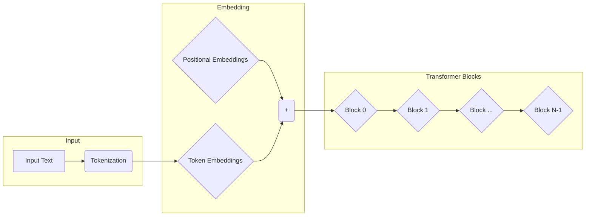
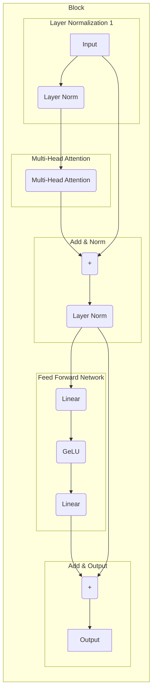
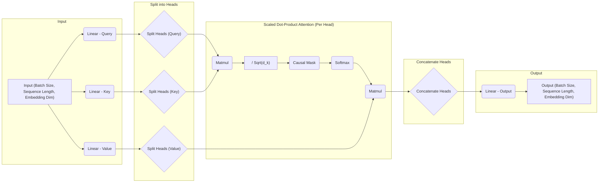

# Transformer (GPT Style) Implementation for Understanding LLMs

This repository is created for understanding Transformer models. It is based on the implementation of [examples/min-gpt](https://github.com/LaurentMazare/tch-rs/blob/main/examples/min-gpt/README.md) from tch-rs. The original code has been modified with added comments for better understanding.

> [!NOTE]
> This repository contains code that is still under development and may contain wrong information.

## How to Run

```bash
export TORCH_CUDA_VERSION=cu121 # If using CUDA.
cargo run -- train # Training
cargo run -- predict gpt1000.ot "Warwick: What is your name?" # Run inference
```

- Training for 1000 steps takes about 10 minutes using `g4dn.xlarge`.

## Architecture Overview

### Overview



### Transformer Block



### Attention Mechanism



## References

- [LaurentMazare/tch-rs: Rust bindings for the C++ api of PyTorch.](https://github.com/LaurentMazare/tch-rs)
- [karpathy/minGPT: A minimal PyTorch re-implementation of the OpenAI GPT (Generative Pretrained Transformer) training](https://github.com/karpathy/minGPT)
- [Build a Large Language Model (From Scratch)](https://www.manning.com/books/build-a-large-language-model-from-scratch)
- [A Comprehensive Guide to Building a Transformer Model with PyTorch | DataCamp](https://www.datacamp.com/tutorial/building-a-transformer-with-py-torch)
- [Transformer Explainer](https://poloclub.github.io/transformer-explainer/)
